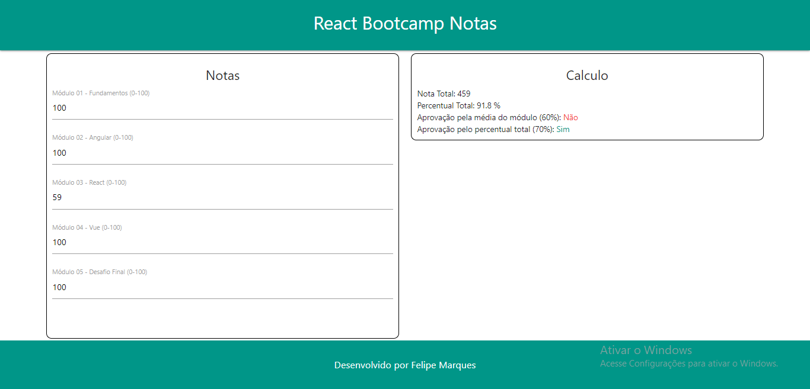

[PT-BR]

# Projeto Controle Notas - Módulo 3 do Bootcamp FrontEnd IGTI

Professor: Raphael Gomide. 
Aluno: Felipe Marques.

## :memo: Status:

- Concluído.

## :dart: Objetivo:

- Exercitaros seguintes conceitos trabalhados noMódulo: 
  ✓ Implementação de aplicações com JavaScript e React  
  ✓ Criação de Class Components

## Imagem do Projeto

## :octocat: Deploy:

[Vercel](https://react-bootcamp-notas.vercel.app/)
